[](https://classroom.github.com/a/mRmkZGKe)
# Network Programming - Assignment G01

## Anggota Kelompok
| Nama           | NRP        | Kelas     |
| ---            | ---        | ----------|
| Farras Abdurrazaq Ar-Rasyid               | 5025241091           | Pemrograman Jaringan D          |
| Willy Marcelius               | 5025241096           | Pemrograman Jaringan D          |

## Link Youtube (Unlisted)
Link ditaruh di bawah ini
```
https://youtu.be/DCXapETS1mw
```

## Penjelasan Program

### 1. Implementasi Message Framing dan Socket Wrapper

```python
def send_msg(sock, data):
    header = struct.pack(">I", len(data))
    sock.sendall(header + data)

def recv_all(sock, n):
    data = bytearray()
    while len(data) < n:
        packet = sock.recv(n - len(data))
        if not packet: return None
        data.extend(packet)
    return bytes(data)

def recv_msg(sock):
    header = recv_all(sock, 4)
    if not header: return None
    length = struct.unpack(">I", header)[0]
    return recv_all(sock, length)
```

- `send_msg` : Menyisipkan Header 4-byte di awal data menggunakan `struct.pack(">I", len(data))`. Ini mengubah angka panjang pesan menjadi format raw bytes Big-Endian untuk memberi tahu penerima ukuran pasti pesan tersebut.
- `recv_all` : Fungsi untuk menerima data dari sebuah socket dalam jumlah tertentu (n byte). Jika jaringan mengalami delay, looping `while` akan menahan program dan merangkai data (`data.extend`) sampai tepat n byte terkumpul utuh.
- `recv_msg` : Fungsi ini membaca 4 byte awal untuk mendapatkan Header yang kemudian dibongkar menggunakan `struct_unpack`, lalu memanggil fungsi `recv_all` untuk mengambil isi pesan sebesar angka tersebut.

### 2. Arsitektur Server

#### A. server-sync.py - Synchronous (One client at a time) 

```python
import socket, struct, os

os.makedirs("server_files", exist_ok=True)

...

while True:
        conn, addr = server.accept() #Server menerima client
        print(f"Connected: {addr}")
        while True:
            msg = recv_msg(conn) #Server looping untuk menerima pesan
            if not msg:
                print(f"Disconnected: {addr}")
                break
            handle_protocol(conn, msg)
        conn.close()
```
- Diawali import standar jaringan dan fungsi OS untuk membuat folder `server_files`
- Server berjalan secara synchronous. Server akan looping pesan client pertama yang masuk -> `msg = recv_msg(conn) `. Jika ada client lain yang mencoba masuk, client tersebut harus antre sampai client pertama selesai. Fitur ini ditangani secara linear oleh fungsi `handle_protocol`.

#### B. server-thread.py - using the threading module

```python
import socket, threading, struct, os

os.makedirs("server_files", exist_ok=True)
clients = []

...

while True:
        conn, addr = server.accept()
        threading.Thread(target=handle_client, args=(conn, addr), daemon=True).start()
```
- Diawali import standar jaringan dan import threading untuk menerapkan modul threading, dan juga fungsi OS untuk membuat folder `server_files`.
- Variabel global `clients []` dideklarasikan di atas untuk menyimpan semua socket client yang masuk agar nantinya pesan bisa dibuat broadcast ke semua orang.
- Server bersifat multi-client. Setiap kali server menerima client baru, server akan membuat Thread baru yang menjalankan fungsi `handle_client`. Setelah itu, server utama langsung kembali dan siap menerima client yang masuk selanjutnya.

#### C. server-select.py - using the select module

```python
import socket, select, struct, os

os.makedirs("server_files", exist_ok=True)

...

inputs = [server]
    print("Select Server listening on port 5000...")
    
    while True:
        read_ready, _, _ = select.select(inputs, [], [])
        for sock in read_ready:
            if sock == server:
                client, addr = server.accept()
                print(f"Connected: {addr}")
                inputs.append(client)
            else:
                msg = recv_msg(sock)
```
- Diawali import standar jaringan dan import select untuk menerapkan modul select, dan juga fungsi OS untuk membuat folder `server_files`
- Mendeklarasikan array `inputs = [server]` untuk daftar socket server yang dipantau untuk sistem OS.
- Program menggunakan I/O Multiplexing yang berjalan dengan satu thread utama. Semua socket client yang masuk ditambahkan ke list `inputs`. Program akan diblokir sementara oleh OS, fungsi `select.select()` hanya akan merespons `read_ready` apabila ada socket di dalam list yang mengirimkan data.

#### D. server-poll.py - using the poll syscall

```python
import socket, select, struct, os

os.makedirs("server_files", exist_ok=True)

... 

server.setblocking(False)
    
    poll_obj = select.poll()
    poll_obj.register(server.fileno(), select.POLLIN)
    
    fd_map = {server.fileno(): server}
    print("Poll Server listening on port 5000... (Run on Linux/WSL)")
    
    while True:
        events = poll_obj.poll()
        for fd, event in events:
            sock = fd_map[fd]
            
            if sock is server:
                conn, addr = server.accept()
                print(f"Connected: {addr}")
                conn.setblocking(False)
                fd_map[conn.fileno()] = conn
                poll_obj.register(conn.fileno(), select.POLLIN)
            elif event & select.POLLIN:
                try:
                    msg = recv_msg(sock)
```
- Diawali import standar jaringan dan import select, dan juga fungsi OS untuk membuat folder `server_files`
- Perintah `server.setblocking(False)` mengubah soket menjadi non-blocking. Ini mencegah thread tunggal pada server mengalami kemacetan total apabila terjadi anomali Network Race.
- Program menggunakan System Call `poll()` dari kernel Linux/Unix. Karena `poll()` berkomunikasi dengan OS menggunakan File Descriptor (fd), server membuat dictionary `fd_map` untuk memetakan angka tersebut kembali ke objek socket aslinya.
- Saat OS mendeteksi aktivitas, server mengecek `fd_map`. Jika yang aktif adalah server utama, berarti ada client baru. Program memanggil `accept()`, mengatur socket client tersebut agar juga bersifat non-blocking -> `conn.setblocking(False)`, menyimpan `fileno()` miliknya ke `fd_map`, dan meregistrasikannya ke `poll_obj`.
- Jika socket yang aktif memicu flag `select.POLLIN`, artinya ada client yang mengirim data. Program memanggil `recv_msg(sock)` untuk memproses data tersebut. Karena socket bersifat non-blocking, seluruh operasi I/O ini dilindungi di dalam blok `try-except`. Jika client terputus secara sepihak, error akan ditangkap oleh `except:` dan koneksinya akan dibersihkan dari `fd_map`.

### 3. Arsitektur Client

```python
import socket, threading, struct, os, sys

...

def main():
    threading.Thread(target=receive_handler, args=(sock,), daemon=True).start()
    print("Connected! Commands: /list, /upload <file>, /download <file>, or just type to chat!")
    os.makedirs("client_files", exist_ok=True)
    
    while True:
        try:
            text = input("> ")
            if not text: continue
```
- Mengimpor modul `threading` untuk concurrency dan `os.makedirs("client_files", exist_ok=True)` untuk secara otomatis membuat folder `client_files` tanpa menyebabkan error jika folder sudah ada.
- Program menunggu user mengetik dan menerima pesan server bersamaan. Thread utama memblokir terminal untuk input `input("> ")`, sementara background thread `receive_handler` berjalan di latar belakang untuk mencetak pesan masuk secara real-time. Parameter `daemon=True` memastikan thread ini otomatis mati jika program utama ditutup.

### 4. Fitur Aplikasi

#### A. Fitur Broadcast Pesan

Pada server-poll.py
```python
def broadcast(fd_map, server_fd, sender_fd, msg_bytes):
    for fd, sock in fd_map.items():
        if fd != server_fd and fd != sender_fd:
            try: send_msg(sock, msg_bytes)
            except: pass
```
Pada server-select.py
```python
def broadcast(inputs, server_socket, sender_sock, msg_bytes):
    for s in inputs:
        if s is not server_socket and s is not sender_sock:
            try: send_msg(s, msg_bytes)
            except: pass
```
Pada server-sync.py
```python
elif cmd == "CHAT":
        send_msg(sock, b"CHAT[Broadcast (Sync is solo)] " + payload)
```
Pada server-thread.py
```python
def broadcast(sender_sock, msg_bytes):
    for c in clients:
        if c != sender_sock:
            try:
                send_msg(c, msg_bytes)
            except:
                pass
```
- Jika client mengetik pesan biasa, data dikirim dengan awalan `CHAT`. Server kemudian mengeksekusi fungsi broadcast sesuai arsitekturnya untuk menyebarkan pesan tersebut ke semua client lain yang sedang terhubung. Daftar client yang dipakai untuk looping berbeda-beda tergantung implementasi. Pada `server-poll` menggunakan `fd_map`, pada `server-select` menggunakan `inputs`, dan pada `server-thread` menggunakan array `clients`. Di dalam loop selalu ada syarat seperti `if c != sender_sock` atau variasinya, yang memastikan pesan tidak dikirim kembali ke pengirim asli agar ia tidak menerima pantulan pesan miliknya sendiri.
- Pada `server-sync` tidak ada fungsi broadcast karena arsitektur sinkron hanya melayani satu client pada satu waktu. Sebagai implementasi broadcast, kami membuat pesan broadcast dengan cara dikirim balik ke client yang sama dengan tambahan label.

#### B. Fitur /list
```python
if cmd == "LIST":
                        files = os.listdir("server_files")
                        send_msg(sock, b"CHAT[Server Files]\n" + ("\n".join(files) if files else "No files.").encode())
```
- Apabila client mengirim command /LIST, server menangkapnya dan menggunakan modul OS `os.listdir("server_files")` untuk membaca semua nama file yang ada di dalam directory milik server. Array nama file ini digabungkan menjadi teks dengan `\n.join()` dan dikirim balik ke client.

#### C. Fitur /upload
```python
elif cmd == "UPLD":
                        parts = payload.split(b'|', 1)
                        if len(parts) == 2:
                            filename = parts[0].decode('utf-8', errors='ignore')
                            with open(f"server_files/{filename}", "wb") as f: f.write(parts[1])
                            broadcast(fd_map, server.fileno(), fd, b"CHAT[Broadcast] User uploaded " + filename.encode())
```
- Client membaca file lokal dengan mode `rb` (read binary) lalu mengirim file ke server dengan format `UPLDnamafile.ext|RAW_DATA`, di mana bagian sebelum `|` adalah nama file dan setelahnya adalah isi file. Server menerima payload ini lalu memecahnya dengan `.split(b'|', 1)`. Angka 1 memastikan hanya tanda | pertama yang dipakai sebagai pemisah, sehingga isi file biner tidak ikut terpotong kalau kebetulan mengandung karakter |. Hasilnya adalah nama file dan isi file. Nama file di-decode ke string, sedangkan isi file langsung ditulis ke folder `server_files` menggunakan `with open(f"server_files/{filename}", "wb")`. Mode `wb` dipakai agar file tersimpan persis seperti aslinya dalam bentuk biner.

#### D. Fitur /download
```python
elif cmd == "DWNL":
                filename = payload.decode('utf-8', errors='ignore')
                filepath = f"server_files/{filename}"
                if os.path.exists(filepath):
                    with open(filepath, "rb") as f:
                        send_msg(conn, b"DRES" + filename.encode() + b"|" + f.read())
                else:
                    send_msg(conn, b"ERR File not found.")
```
- Fitur download ini bekerja kebalikan dari upload. Client mengirim perintah `DWNL` dengan nama file yang ingin diambil. Server lalu mengecek apakah file tersebut ada di folder `server_files`. Jika ada, file dibuka dengan mode `rb` supaya isi file terbaca utuh dalam bentuk byte. Data kemudian dikirim balik ke klien dengan format `DRESnamafile.ext|RAW_DATA`, di mana DRES menandakan respon download, diikuti nama file dan isi file.

## Screenshot Hasil

### server-select.py
- Fitur upload
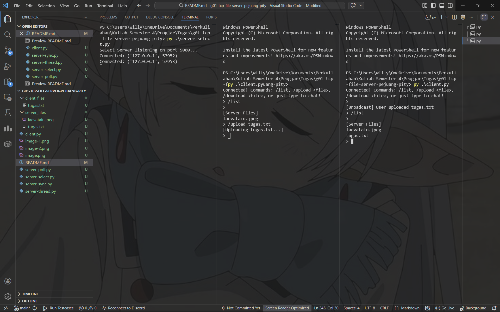

- Fitur download 
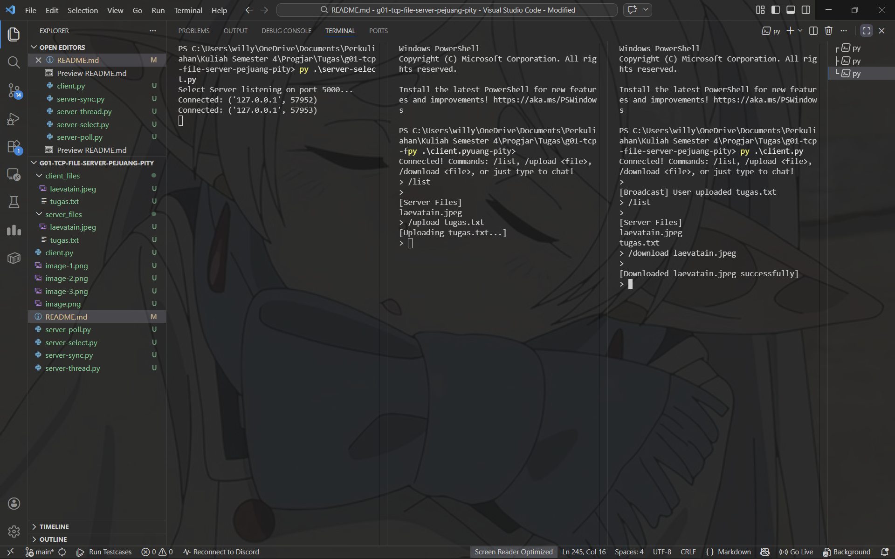

- Fitur list
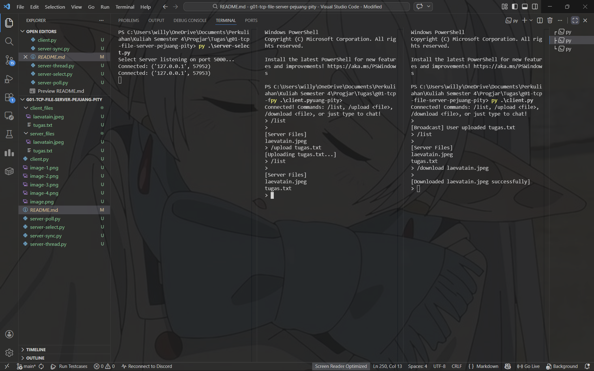

### server-sync.py
- Fitur upload
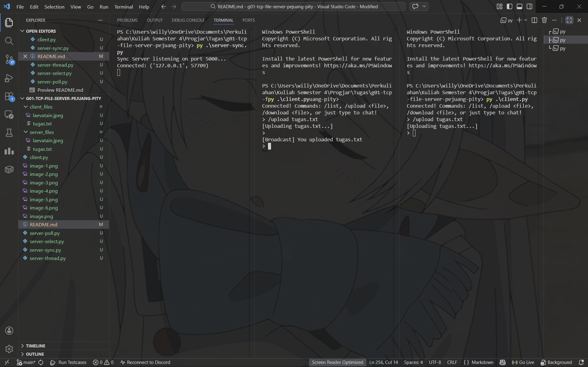
`Dapat dilihat pada terminal server, hanya ada satu client yang terhubung di satu waktu. Lalu, pada client yang terhubung lebih dahulu (client 1) dapat menjalankan command untuk upload file ke server, sedangkan client yang mencoba untuk terhubung pada saat client 1 sedang terhubung tidak dapat menjalankan command nya.`

- Fitur download
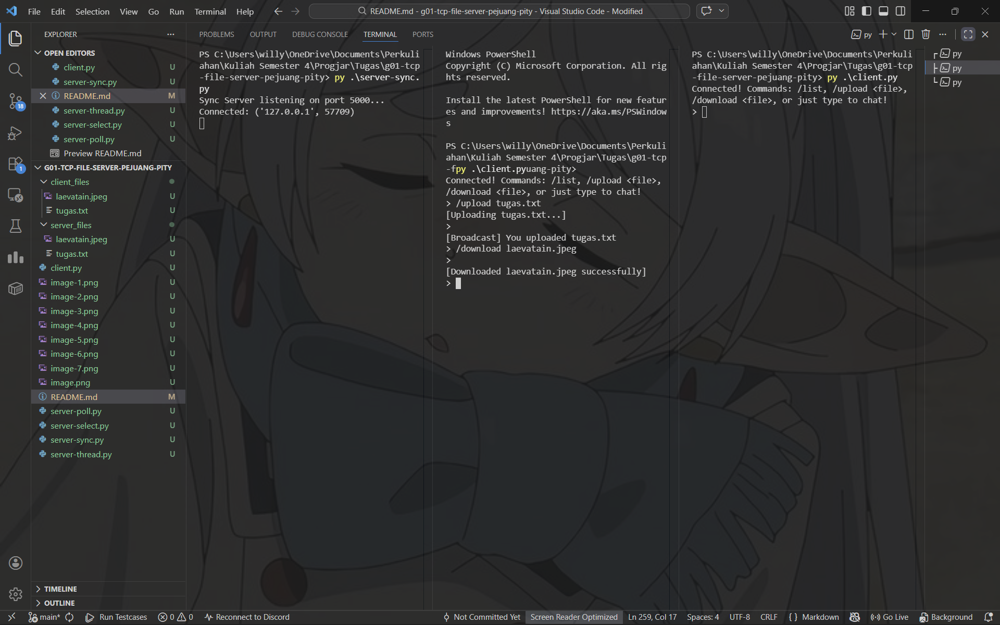

- Fitur list
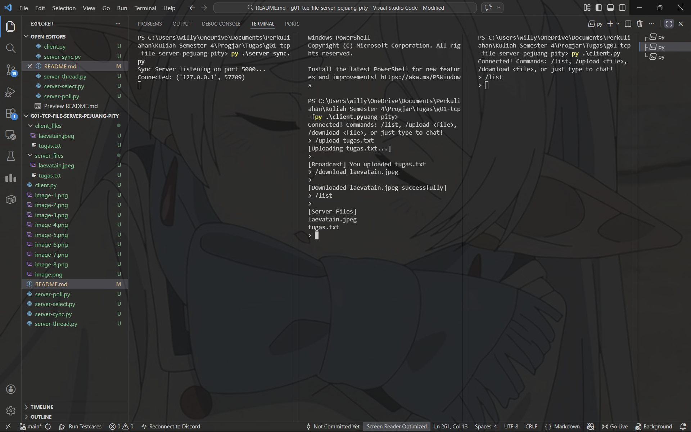


### server-thread.py
- Fitur upload
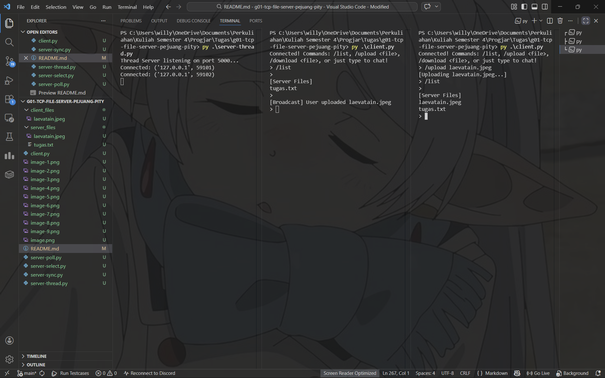

- Fitur download
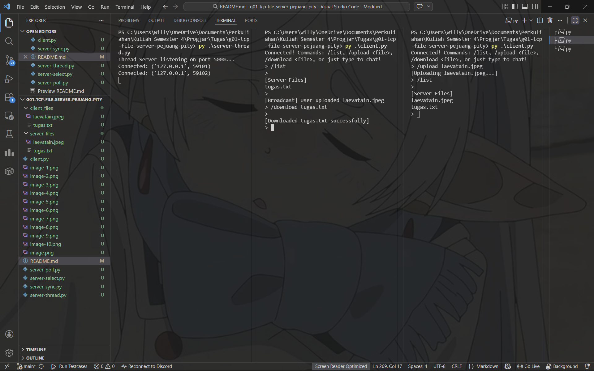

- Fitur list
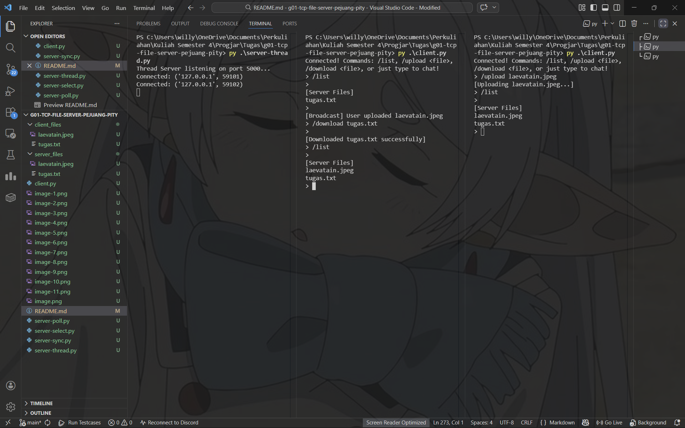

### server-poll.py
- Fitur upload
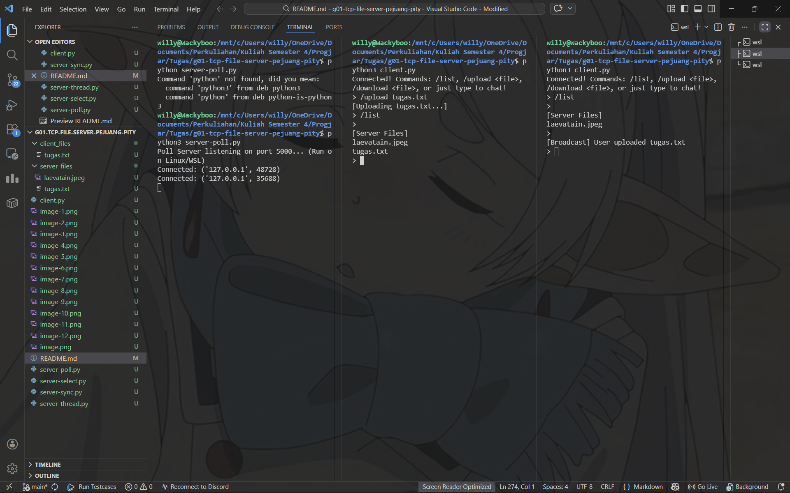

- Fitur download
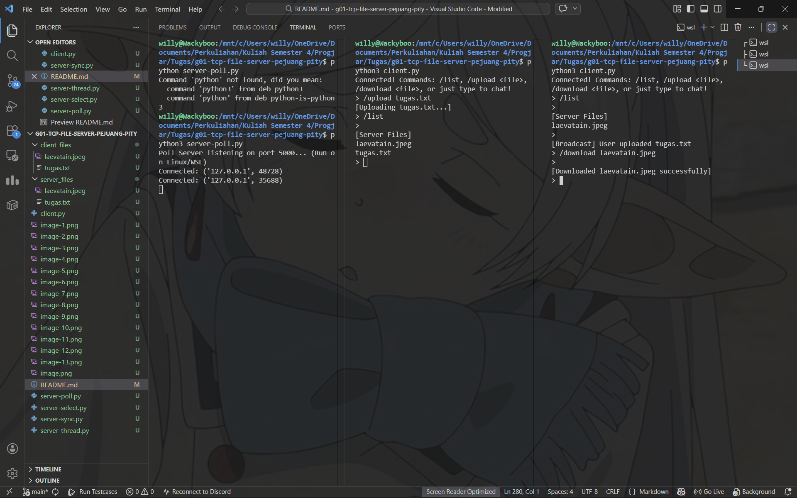

- Fitur list
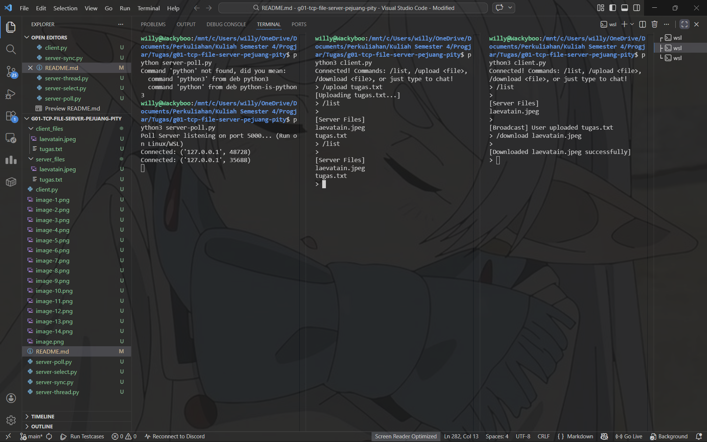
